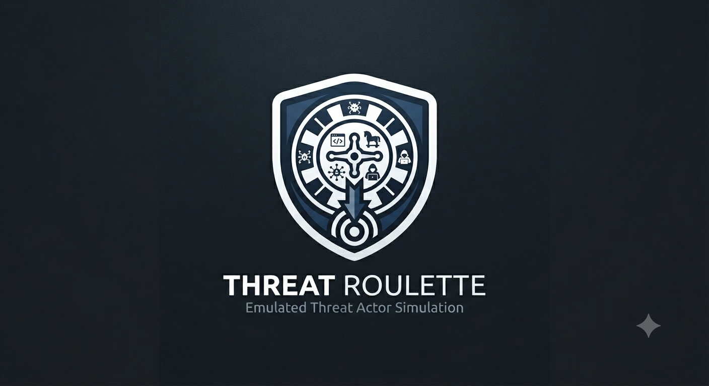
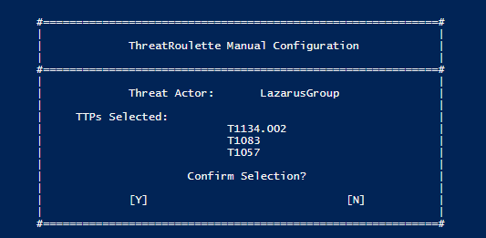

# ThreatRoulette
Wrapper for the AtomicRedTeam tool that automates Threat Actor emulation
<br><br>
<a id="readme-top"></a>

<!-- PROJECT LOGO -->
<div align="center">
  <a href="https://github.com/raxxoon-in-the-wires/">
    
  </a>
</div>
<br>

<!-- TABLE OF CONTENTS -->
<details>
  <summary>Table of Contents</summary>
  <ol>
    <li>
      <a href="#about-the-project">About The Project</a>
    </li>
    <li>
      <a href="#getting-started">Getting Started</a>
      <ul>
        <li><a href="#prerequisites">Prerequisites</a></li>
        <li><a href="#installation">Installation</a></li>
      </ul>
    </li>
    <li><a href="#usage">Usage</a></li>
    <li><a href="#license">License</a></li>
    <li><a href="#contact">Contact</a></li>
    <li><a href="#acknowledgments">Acknowledgments</a></li>
  </ol>
</details>
<br>


<!-- ABOUT THE PROJECT -->
## Disclaimer

This tool is intended for authorized security testing only. Use against systems
you do not own or have explicit written permission to test is illegal.

## Dependencies

Built on top of [Atomic Red Team](https://github.com/redcanaryco/atomic-red-team) by Red Canary.

## About The Project

<div align="center">
  <a href="https://github.com/raxxoon-in-the-wires/">
    
  </a>
</div>
<br>

This project came about while I was building a "Threat-Hunt-in-a-Box" for AWS. I wanted a way to generate random Threat Actor activity for a true test of Threat Hunting capability to challenge myself. By publishing this, I'm hoping to support other people in the industry looking to learn more about Threat Hunting and test their ability to investigate an environment. 

Happy hunting! 😄


### Built With

This section should list any major frameworks/libraries used to bootstrap your project. Leave any add-ons/plugins for the acknowledgements section. Here are a few examples.

* [![PowerShell][PowerShell-shield]][PowerShell-url]
* [![Atomic Red Team][AtomicRedTeam-shield]][AtomicRedTeam-url]

<p align="right">(<a href="#readme-top">back to top</a>)</p>


<!-- GETTING STARTED -->
## Getting Started


### Prerequisites

This is an example of how to list things you need to use the software and how to install them.
- PowerShell 5.1+
- [Atomic Red Team](https://github.com/redcanaryco/atomic-red-team) installed
- [Invoke-AtomicRedTeam](https://github.com/redcanaryco/invoke-atomicredteam) module
- MITRE ATT&CK JSON files for your target threat actors

### Installation

1. Clone this repository
   ```sh
   git clone https://github.com/raxxoon-in-the-wires/ThreatRoulette.git
   ```

2. Install the Invoke-AtomicRedTeam module
   ```powershell
   IEX (New-Object Net.WebClient).DownloadString('https://raw.githubusercontent.com/redcanaryco/invoke-atomicredteam/master/install-atomicredteam.ps1')
   Install-AtomicRedTeam
   ```

3. Download MITRE ATT&CK Navigator layers for your target threat actors
   - Navigate to [attack.mitre.org/groups](https://attack.mitre.org/groups/) and select a threat actor
   - Under **Techniques Used**, click **ATT&CK Navigator Layers** and download the Enterprise layer
   - Rename each file to `[ThreatActorName]-TTPs.json` (e.g. `MuddyWater-TTPs.json`)
   - Place all JSON files in your chosen `MitreTTPsLocation` folder

<p align="right">(<a href="#readme-top">back to top</a>)</p>


<!-- USAGE EXAMPLES -->
## Usage

.\AtomicRedAutomation.ps1 -MitreTTPsLocation "C:\AtomicRed\MitreTTPs" -Atomics "C:\AtomicRed\atomics"


### Parameters

| Parameter | Description | Default |
|---|---|---|
| `MitreTTPsLocation` | Path to folder containing MITRE ATT&CK JSON files | `C:\AtomicRedTeam\MitreTTPs` |
| `Atomics` | Path to Atomic Red Team atomics folder | `C:\AtomicRedTeam\atomics` |
| `ConfigRecord` | Output path for the run log | Auto-generated with timestamp |

<p align="right">(<a href="#readme-top">back to top</a>)</p>

<!-- ROADMAP -->
## Roadmap

This wrapper is purely a side project of a side project. No promises that I'll maintain or improve this over time, I hope to see others take an run with it!

Potential Changes:
- [ ] Automated download of Mitre ATT&CK TTPs
- [ ] More precise attacker emulation
      
See the [open issues](https://github.com/raxxoon-in-the-wires/ThreatRoulette/issues) for a full list of proposed features (and known issues).


<!-- CONTRIBUTING -->
## Contributing

Contributions are what make the open source community such an amazing place to learn, inspire, and create. Any contributions you make are **greatly appreciated**.

If you have a suggestion that would make this better, please fork the repo and create a pull request. You can also simply open an issue with the tag "enhancement".
Don't forget to give the project a star! Thanks again!

1. Fork the Project
2. Create your Feature Branch (`git checkout -b feature/AmazingFeature`)
3. Commit your Changes (`git commit -m 'Add some AmazingFeature'`)
4. Push to the Branch (`git push origin feature/AmazingFeature`)
5. Open a Pull Request

### Top contributors

<a href="https://github.com/raxxoon-in-the-wires/ThreatRoulette/graphs/contributors">
  
</a>


## License

Distributed under the MIT License. See `LICENSE.txt` for more information.


## Acknowledgments

* [Red Canary](https://redcanary.com/) — creators of Atomic Red Team
* [othneildrew - Best-README-Template](https://github.com/othneildrew/Best-README-Template/tree/main)

<p align="right">(<a href="#readme-top">back to top</a>)</p>


<!-- MARKDOWN LINKS & IMAGES -->
[product-screenshot]: images/screenshot.png
[PowerShell-shield]: https://img.shields.io/badge/PowerShell-5391FE?style=for-the-badge&logo=powershell&logoColor=white
[PowerShell-url]: https://github.com/PowerShell/PowerShell
[AtomicRedTeam-shield]: https://img.shields.io/badge/Atomic%20Red%20Team-E83E3E?style=for-the-badge&logoColor=white
[AtomicRedTeam-url]: https://github.com/redcanaryco/atomic-red-team
